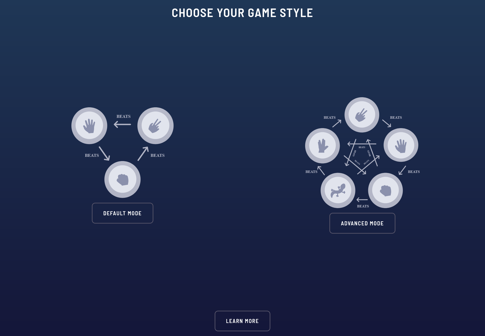
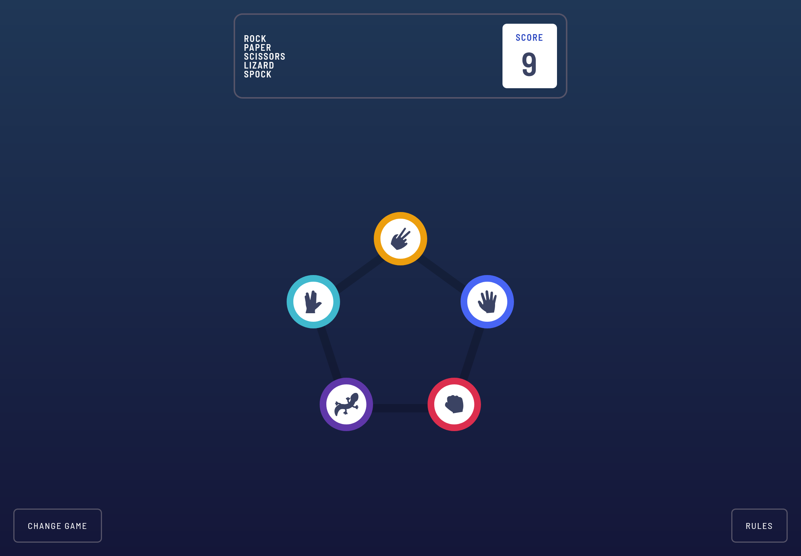
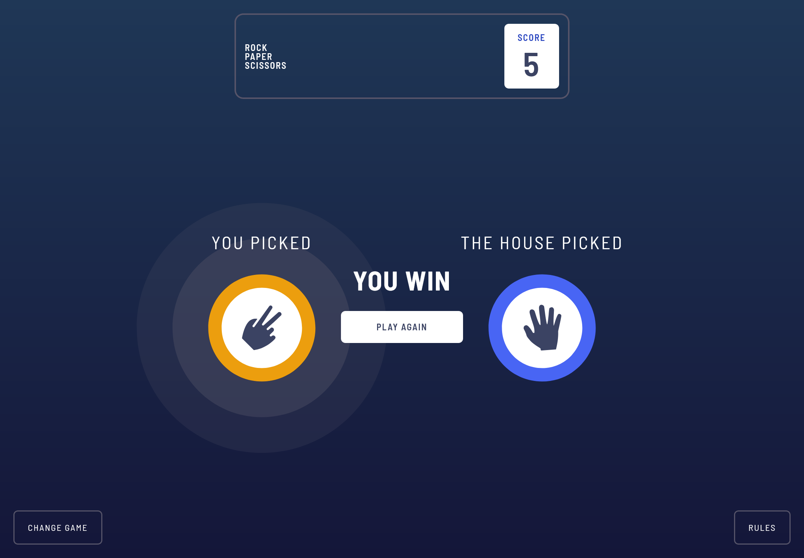
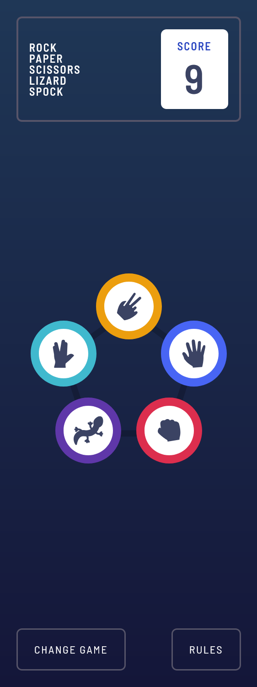

# Frontend Mentor - Rock, Paper, Scissors solution

This is a solution to the [Rock, Paper, Scissors challenge on Frontend Mentor](https://www.frontendmentor.io/challenges/rock-paper-scissors-game-pTgwgvgH). Frontend Mentor challenges help you improve your coding skills by building realistic projects.

## Table of contents

- [Overview](#overview)
  - [The challenge](#the-challenge)
  - [Screenshot](#screenshot)
  - [Links](#links)
- [My process](#my-process)
  - [Built with](#built-with)
  - [What I learned](#what-i-learned)
  - [Continued development](#continued-development)
  - [Useful resources](#useful-resources)
- [Author](#author)
- [Acknowledgments](#acknowledgments)

## Overview

### The challenge

Users should be able to:

- View the optimal layout for the game depending on their device's screen size
- Play Rock, Paper, Scissors against the computer
- Maintain the state of the score after refreshing the browser _(optional)_
- **Bonus**: Play Rock, Paper, Scissors, Lizard, Spock against the computer _(optional)_

Get up and running with few steps:

- Install the dependancies
  ```bash
  pnpm install
  ```
- Start the server
  ```bash
  pnpm dev
  ```
- Build a production preview
  ```bash
  pnpm build
  ```
- Preview the built file
  ```bash
  pnpm preview
  ```

### Screenshot






### Links

- Solution URL: [Github Repo](https://github.com/vickbk/rock-paper-scissors)
- Live Site URL: [Github Pages](https://vickbk.github.io/rock-paper-scissors)

## My process

### Built with

- Semantic HTML5 markup
- CSS custom properties
- Mobile-first workflow
- [SASS](https://sass-lang.com/) - CSS Preprocessor
- [Tailwindcss](https://tailwindcss.com/) - CSS framework
- [React](https://reactjs.org/) - JS library
- [Vite](https://vite.dev/) - A build tool for the web

### What I learned

In this project I learnt to work with Routers in react outside nextjs to which I was used initially. I also learnt how to position items following a certain angle using CSS and JS.

```html
<li
  className="absolute choice"
  data-left="${transX}%"
  data-top="${transY}%"
  style="--transX: `${transX}%`, --transY: `${transY}%`"
>
  {children}
</li>
```

```css
.choice {
  --transX: attr(data-left type(<percentage>), var(--transX, 0%));
  --transY: attr(data-top type(<percentage>), var(--transY, 0%));
  left: var(--transX);
  top: var(--transY);
}
```

```js
const transX = (Math.round(Math.cos(degToRad(angle)) * 100) + 100) / 2;
const transY = (100 - Math.round(Math.sin(degToRad(angle)) * 100)) / 2;
```

### Continued development

I will keep using good practices and learn more about them.

### Useful resources

- [Roadmap](https://roadmap.sh) - Helped me get started with this journey and still leading me throughout the process
- [Frontend Mentor](https://www.frontendmentor.io) - Currently working with frontend mentor is upskilling me and I want to learn more here... Im not yet to leave

## Author

- Github - [@vickbk](https://github.com/vickbk)
- Frontend Mentor - [@vickbk](https://www.frontendmentor.io/profile/vickbk)
- Twitter - [@Vick_bk8](https://x.com/Vick_bk8)

## Acknowledgments

For this project I use most of the knowlegde I got from the frontend roadmap, frontendmentor for HTML & css tricks and technics, accessibility and various developement techniques...
